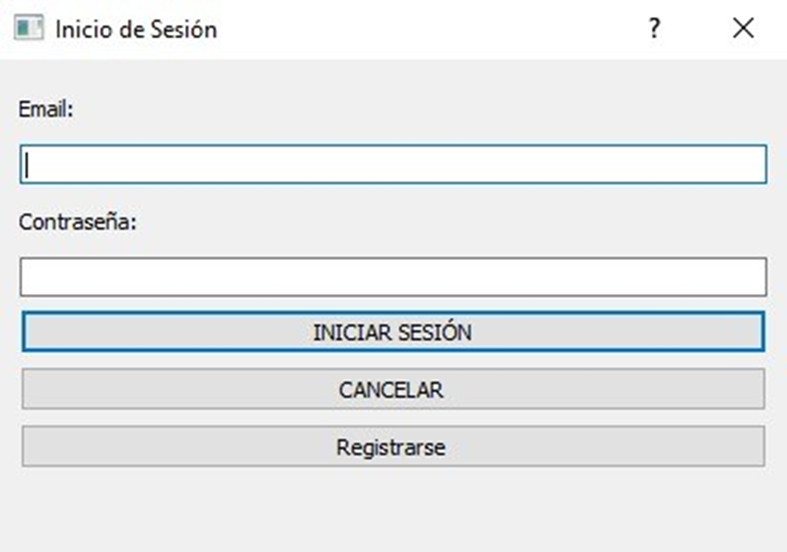
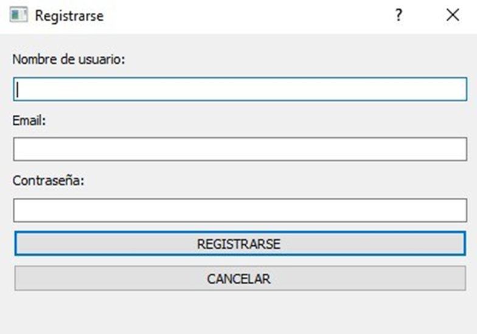
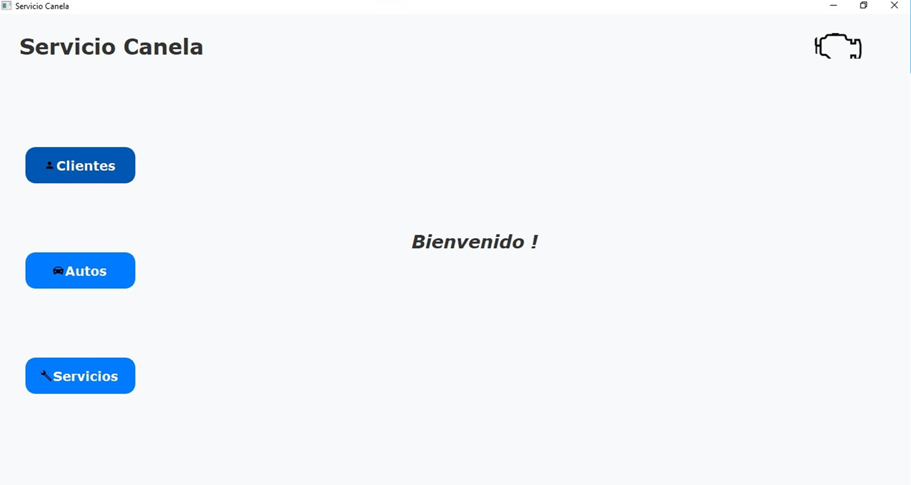
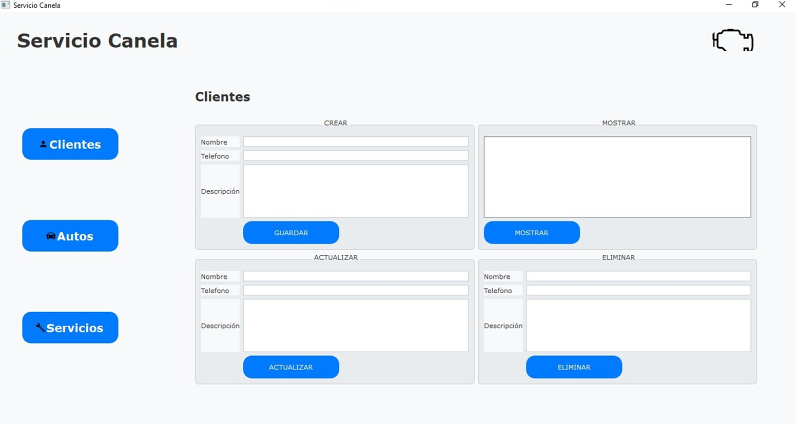
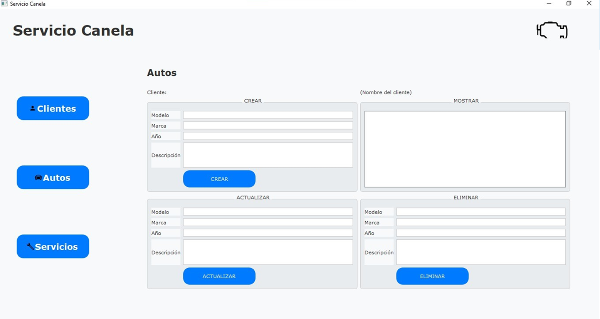
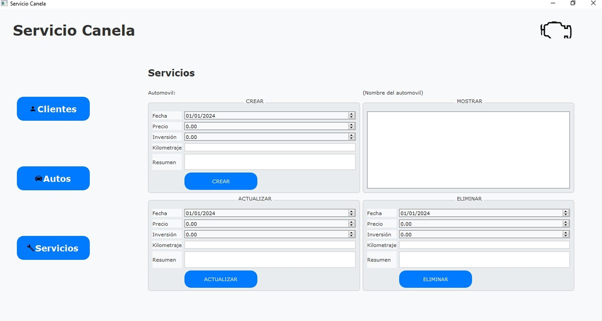

#  Sistema de gestion de clientes para Taller Mecanico (PySide2)
Proyecto escolar de la materia Ingenieria de Software.

## DESCRIPCIÓN
Se creo una interfaz grafica con python para poder manipular la informacion de clientes de un taller mecanico
el cual solo almacena datos de clientes, sus automoviles y los servicios de cada uno,
la base de datos y el backend en php fueron montados en un servidor de 000webhost.

## Imagenes del proyecto

### Iniciar sesion

### Registrarse

### Bienvenida

### Clientes

### Automoviles

### Servicios
